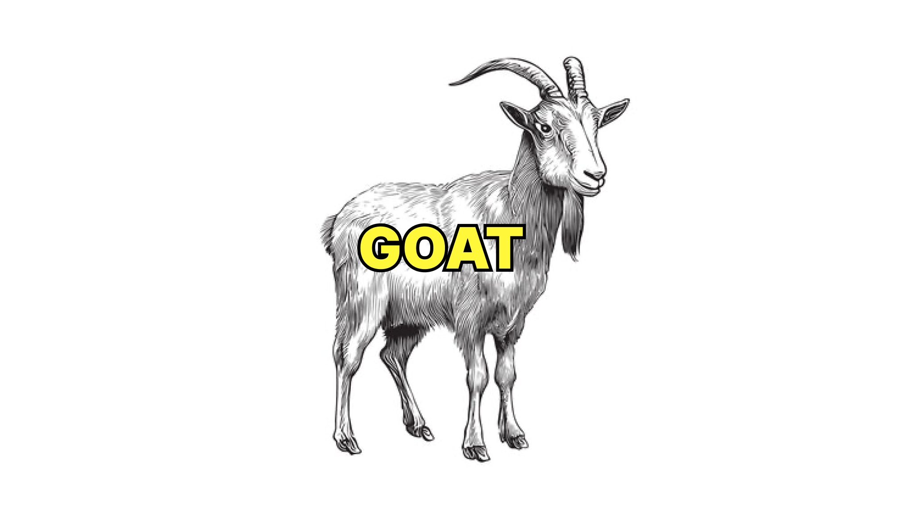

# GOAT



This project is a starting point for developing static web apps using [a-h/templ](https://github.com/a-h/templ).

## Tech Stack
- [Go](https://golang.org/) (with [Templ](https://github.com/a-h/templ) for logic behind templating)
- [Alpine.js](https://alpinejs.dev/) (JavaScript framework)
- [Tailwind CSS](https://tailwindcss.com/) (CSS framework)
- [Vite](https://vitejs.dev/) (optional, for hot reloading)

## Dependencies
- Alpine.js (as a file under /public/static/js/alpine.min.js)
- [Bun](https://bun.sh/) (or [Yarn](https://yarnpkg.com/) or [pnpm](https://pnpm.io/)) used to install/run Vite and Tailwind CSS
- Go
- Templ CLI (install using `go install github.com/a-h/templ/cmd/templ@latest`)
- [Make](https://www.gnu.org/software/make/)
- [entr](https://github.com/eradman/entr)

## Usage
1. Clone the repo:
   ```
   git clone https://github.com/morethancoder/goat.git
   ```

2. Initialize the project:
   ```
   go mod init yourprojectname && go mod tidy
   ```

3. Change the import in main.go:
   ```go
   // Change this:
   "morethancoder/goat/components"
   // To:
   "yourprojectname/components"
   ```

4. Install required Node modules:
   ```
   bun install
   ```

5. Start the Vite dev server:
   ```
   make vite
   ```

6. Start file watching & compiling:
   ```
   make watch
   ```

7. Star the repo!
